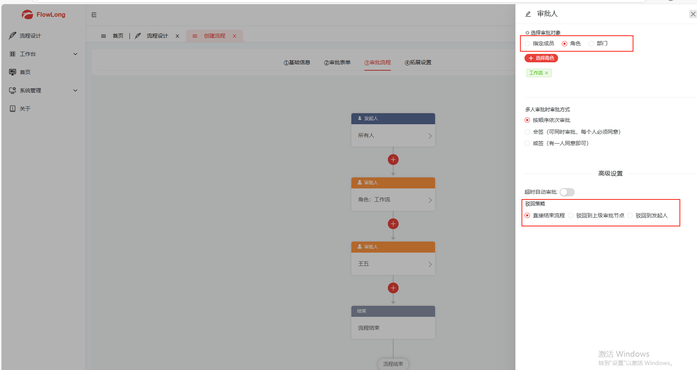
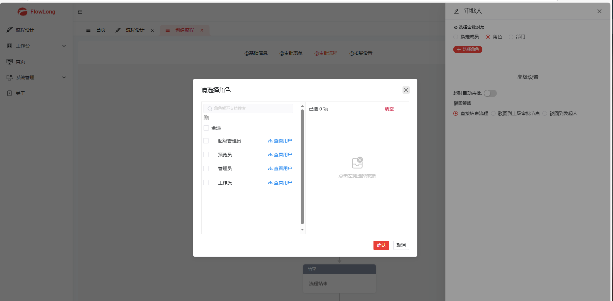
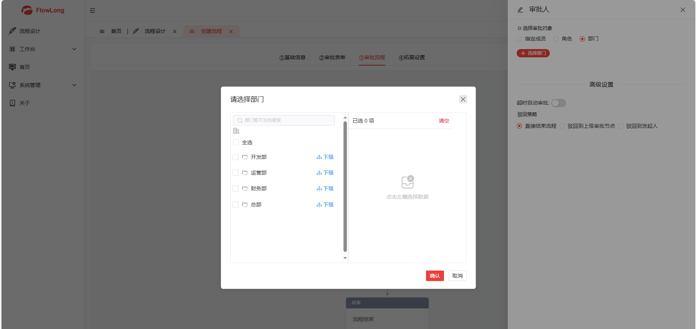
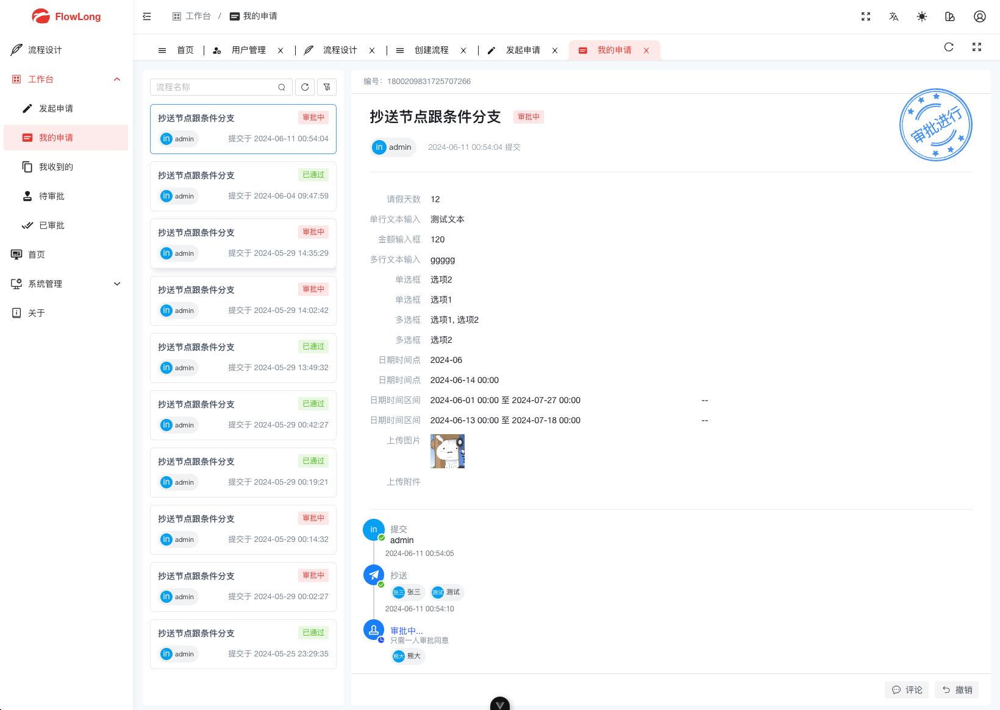
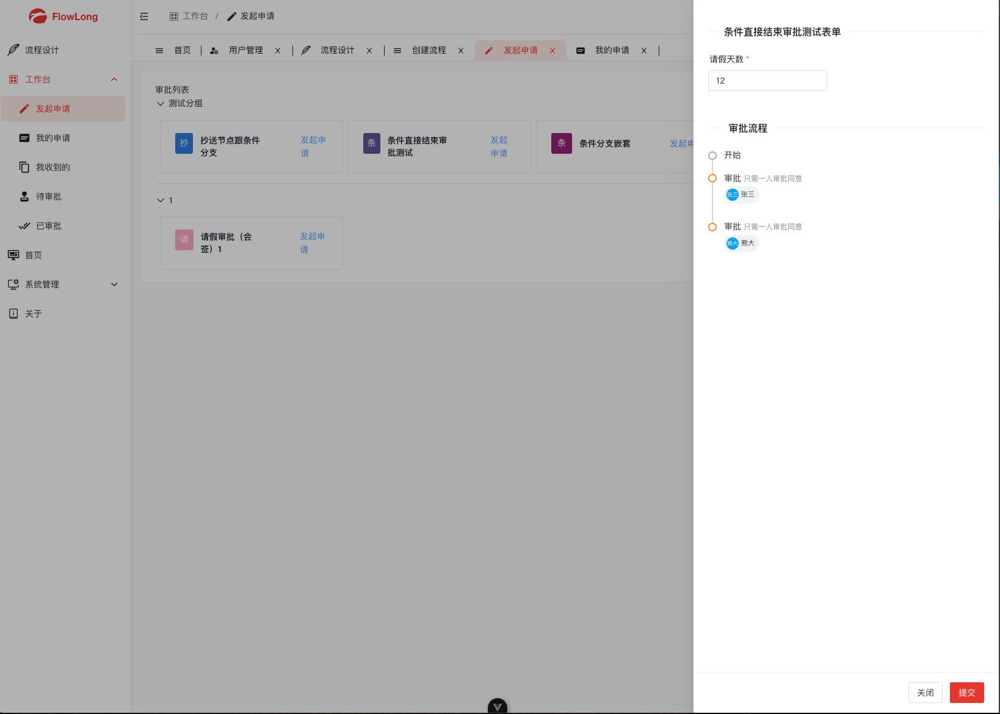
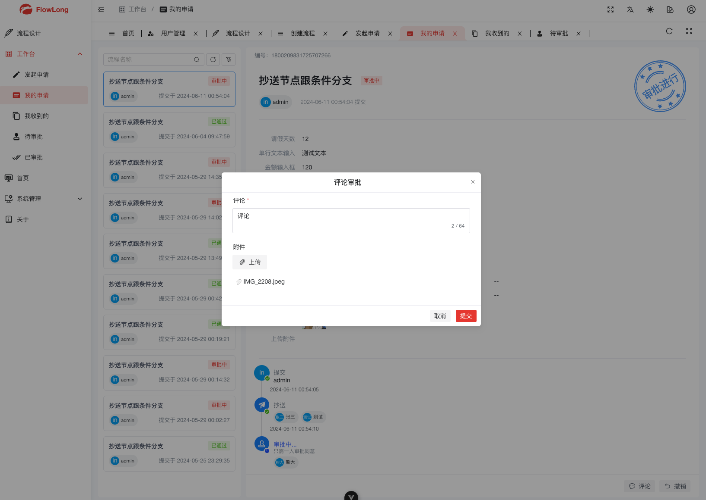
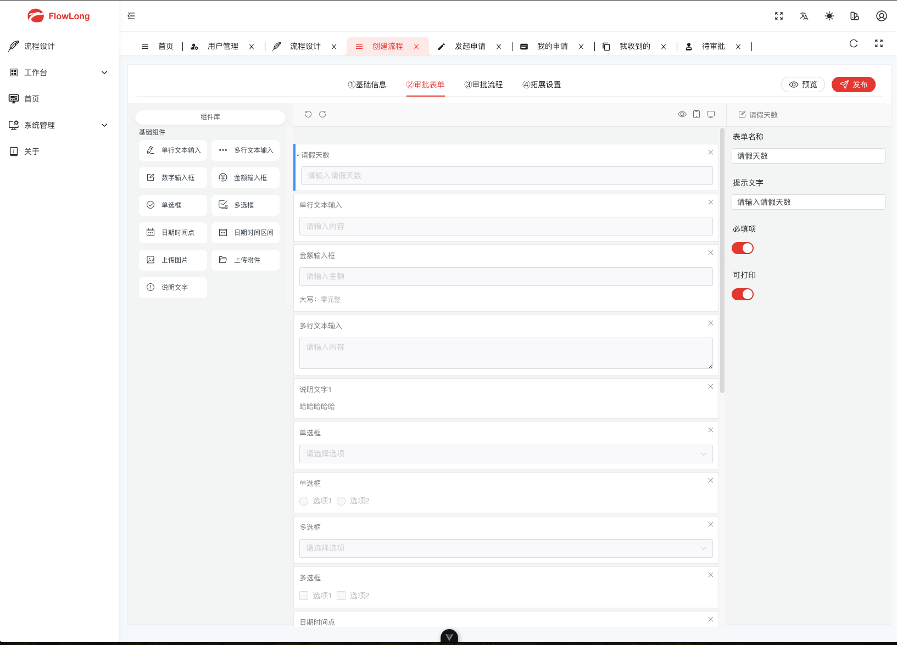
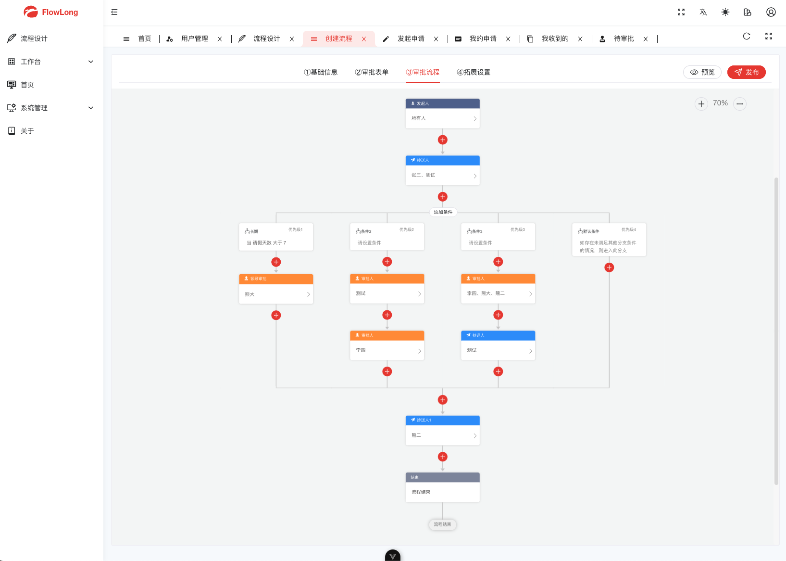

# 🔥🔥🔥 国产工作流 flowlong-plus-new-1.1.9版本-配套前端项目
# 项目介绍
>本项目 为flow-long-plus-new 配套前端项目,
>
> 这里给出flowlong官方授权链接：https://doc.flowlong.com/docs/authorization.html

> 原作者：FlowLong https://gitee.com/aizuda/flowlong

>  二开作者：FlowLong-Plus(0.0.5版本) 开源地址,
>
> 非常感谢二开作者铺好的路,他手搓出来前后端代码，让我能够使用现成的轮子
>
>
>后端：https://gitee.com/flowlong-plus/flowlong-plus
>
>前端：https://gitee.com/flowlong-plus/flowlong-web

> 三开作者：FlowLong-Plus-New(1.1.9版本，也就是本项目)
>
> 后端：https://gitee.com/Java-ZhangYi/flowlong-plus-new.git
>
>前端：https://gitee.com/Java-ZhangYi/flowlong-plus-new-web.git
## 新增功能
> 1.新增驳回策略，支持驳回到上一级、驳回到发起人、直接结束流程。
>
> 2 新增支持指定角色/部门审核，目前实现由当前操作者 自动认领任务，随后再执行审批任务。
>
> 3.使用源码引入的方式接入FlowLong流程引擎。
>
> 4.修改了二开作者的后端版本：从【0.0.5】 ==》升级到了【1.1.9】
>
> 
> 
>  

## 🌵 预览

项目截图请往下翻。【**此处截图沿用了二开作者的截图**，新增了驳回策略截图】

## ✈️ 功能完善列表

| 支持功能 | 功能描述                                                                    | 完成程度 |
|------|-------------------------------------------------------------------------| -------- |
| 顺序会签 | 指同一个审批节点设置多个人，如A、B、C三人，三人按顺序依次收到待办，即A先审批，A提交后B才能审批，需全部同意之后，审批才可到下一审批节点。 | ✅        |
| 并行会签 | 指同一个审批节点设置多个人，如A、B、C三人，三人会同时收到待办任务，需全部同意之后，审批才可到下一审批节点。                 | ✅        |
| 或签   | 一个流程审批节点里有多个处理人，任意一个人处理后就能进入下一个节点                                       | ✅        |
| 票签   | 指同一个审批节点设置多个人，如A、B、C三人，分别定义不同的权重，当投票权重比例大于 50% 就能进入下一个节点                | ✅        |
| 抄送   | 将审批结果通知给抄送列表对应的人，同一个流程实例默认不重复抄送给同一人                                     | ✅        |
| 驳回   | 驳回流程支持【驳回到上一级、驳回到发起人、直接结束流程】                                                                        | ✅        |
| 撤销   | 流程发起者可以对流程进行撤销处理                                                        | ✅        |
| 评论   | 与当前活动任务处理人沟通                                                            | ✅        |
| 终止   | 在任意节点终止流程实例                                                             | ✅        |
| 认领   | 审批节点中 指定某一角色/部门审核时，目前实现由当前操作者 自动认领任务，随后再执行审批任务                          | ✅        |
| 其他功能 | 持续完善中...                                                                | ing...   |

## 📚 文档

正在努力编写中...

## 🎃 截图

## 💡 交流
有事邮箱或者qq联系 1149591237@qq.com

# 代码提交命令（忽略检查）
###  git commit -m "[feat] XXX " --no-verify
